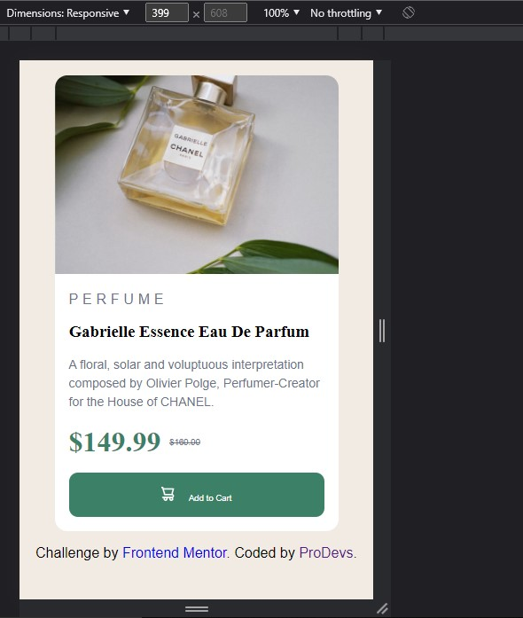

# Frontend Mentor - Product preview card component solution

## Table of contents

- [Overview](#overview)
  - [Screenshot](#screenshot)
  - [Links](#links)
- [My process](#my-process)
  - [Built with](#built-with)
- [Author](#author)

## Overview

This is a solution to the [Product preview card component challenge on Frontend Mentor](https://www.frontendmentor.io/challenges/product-preview-card-component-GO7UmttRfa). Frontend Mentor challenges help you improve your coding skills by building realistic projects.

### Screenshot

### Links

- Solution URL: (https://github.com/Dprof-code/product-preview-card-component)
- Live Site URL: (https://beamish-mooncake-25344e.netlify.app/)

## My process

### Built with

- Semantic HTML5 markup
- CSS custom properties
- Flexbox
- Javascript DOM
- Media Queries

## Author

- Website - [Olawale Adedamola](https://www.linkedin.com/in/olawale-adedamola-b9b1641a2/)
- Frontend Mentor - [@Dprof-code](https://www.frontendmentor.io/profile/Dprof-code)
- Twitter - [@pr0devs](https://www.twitter.com/pr0devs)